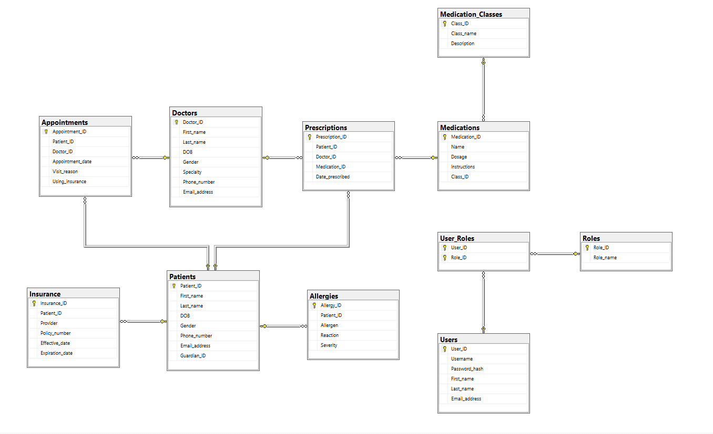
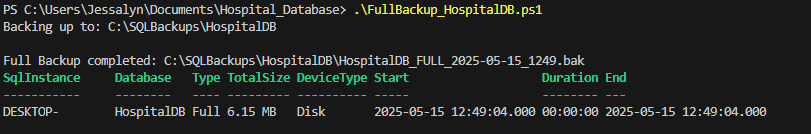
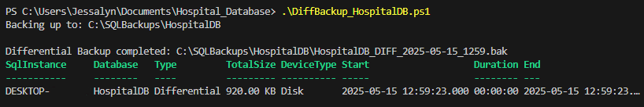

# Hospital Database - SQL Server Project

This project is a comprehensive, role-based hospital database system built using Microsoft SQL Server. It models key entities such as patients, doctors, prescriptions, insurance, and user roles, with support for views, stored procedures, and triggers.

## 📦 Project Structure

| File                        | Description                                                  |
|----------------------------|--------------------------------------------------------------|
| `hbd_schema.sql`            | Creates all necessary tables (patients, doctors, prescriptions, etc.) |
| `hbd_sample_data.sql`       | Inserts mock data for testing                                 |
| `hbd_views_and_procedures.sql` | Defines views, stored procedures, and a trigger for appointment validation |
| `backup_scripts/` | Contains PowerShell scripts for backups |
| `docs/` | Contains diagrams, and screenshots |


## 🔧 Features

- Normalized relational schema
- Role-based access via `Users`, `Roles`, and `User_Roles` tables
- Intelligent views for:
  - Doctors (appointments, prescriptions)
  - Nurses (medications and allergies)
  - Receptionists (insurance tracking, appointment history)
- Stored procedures for:
  - Booking appointments
  - Viewing patient prescriptions
  - Checking active insurance
  - Role-based view access
- Trigger that blocks appointment booking with insurance if no valid insurance exists

## 🛡️ Backup (PowerShell + dbatools)
This project includes production-style backup automation using PowerShell and the dbatools module.

💾 Scripts Included
| Script                        | Purpose                                                  |
|----------------------------|--------------------------------------------------------------|
| `FullBackup_HospitalDB.ps1` | Creates a timestamped full backup |
| `DiffBackup_HospitalDB.ps1` | Creates a differential backup after the full         

🧪 Example Usage
```powershell
# Full backup
./FullBackup_HospitalDB.ps1

# Make some changes...

# Differential backup
./DiffBackup_HospitalDB.ps1
```
📁 Backup Directory Setup

Backups are stored by default in:
```
C:\SQLBackups\HospitalDB
```
With readable timestamps like:
```
HospitalDB_FULL_2025_05_14_2100.bak
HospitalDB_DIFF_2025_05_14_2130.bak
```

✅ The scripts will automatically create this folder if it does not exist.

You can change the backup directory by modifying $backupDir in the script.

Ensure your SQL Server service account has write access to this folder.
## 🧪 How to Run
1. Open SQL Server Management Studio (SSMS)
2. Run `hbd_schema.sql` to initalize database and create tables
3. Run `hbd_sample_data.sql` to populate the database
4. Run `hbd_views_and_procedures.sql` to define logic and security
5. Use PowerShell scripts for backup operations (see /backup_scripts folder)


## ✅ Requirements
- Microsoft SQL Server (2019+ recommended)
- SSMS or a compatible query tool
- Basic understanding of SQL
- PowerShell 7+
- dbatools PowerShell module

Install dbatools in Powershell:
```
Install-Module dbatools
```

## 🚀 Future Improvements
- Add frontend UI
- Integrate appointment scheduling calendar
- Add patient login and digital health records interface
- Zip and archive old backups
- Sync backups to cloud

## 📝 Hospital ERD



## 📝 Full Backup Output


## 📝 Differential Backup Output


## 🤝 Contributing
Contributions are welcome! If you’d like to improve this project or add features:

1. Fork the repository
2. Create a new branch (`git checkout -b feature/your-feature-name`)
3. Commit your changes (`git commit -m 'Add feature'`)
4. Push to your branch (`git push origin feature/your-feature-name`)
5. Open a Pull Request

Please follow SQL and naming best practices. For major changes, open an issue first to discuss what you’d like to propose.
